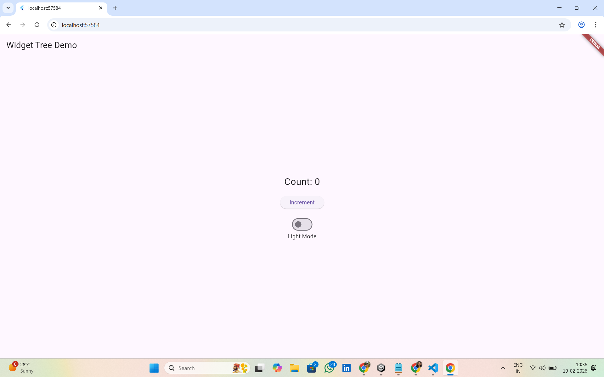
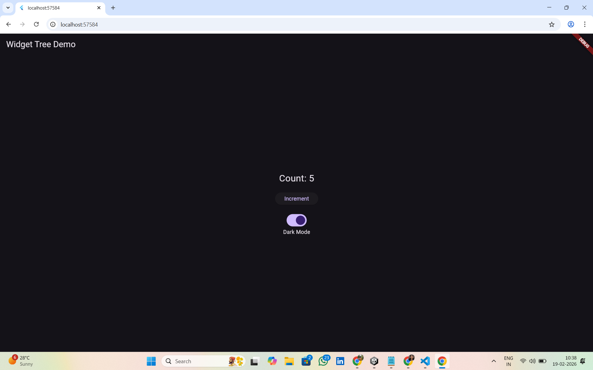

# 🐾 PawTrust – Widget Tree & Reactive UI Model (Sprint #2)

## 📌 Project Overview

This Sprint #2 submission focuses on understanding Flutter’s **Widget Tree** and its **Reactive UI Model**.

In this implementation, we built a simple interactive demo inside PawTrust to demonstrate:

- 🌳 How Flutter UI is structured using a widget tree
- 🔄 How Flutter automatically rebuilds UI when state changes
- ⚡ How `setState()` triggers efficient UI updates

The goal of this sprint is to understand how Flutter builds, manages, and updates dynamic user interfaces.

---

## 🎯 Objective of This Sprint

- Understand Flutter's widget hierarchy structure
- Visualize how widgets are nested inside each other
- Demonstrate Flutter’s reactive programming model
- Show automatic UI updates using `setState()`
- Document widget tree structure clearly

---

## 🚀 Features Implemented

### 🌳 Widget Tree Demonstration
- ✅ Root `MaterialApp`
- ✅ `Scaffold` structure
- ✅ `AppBar` with title
- ✅ Centered layout using `Center`
- ✅ Vertical arrangement using `Column`
- ✅ Interactive widgets inside the column

### 🔄 Reactive UI Demonstration
- ✅ Counter that updates dynamically
- ✅ Theme switcher (Light / Dark Mode)
- ✅ UI rebuilds automatically using `setState()`
- ✅ Only affected widgets update (efficient rendering)

---

## 🌳 Widget Tree Structure

Below is the widget hierarchy used in this demo:

MaterialApp
┗ Scaffold
┣ AppBar
┗ Body
┗ Center
┗ Column
┣ Text (Count Display)
┣ SizedBox
┣ ElevatedButton (Increment)
┣ SizedBox
┣ Switch (Theme Toggle)
┗ Text (Theme Label)

This structure shows how every UI element in Flutter is a widget and how they are nested hierarchically.

---

## 🔄 State Management Logic

Two state variables were used:

- `int count` → stores the counter value
- `bool isDark` → controls theme mode

When the button is pressed:
- `setState()` increases the counter
- Flutter rebuilds the `Text` widget displaying the count

When the switch is toggled:
- `setState()` changes the theme
- Flutter rebuilds the app with dark or light mode

Flutter does NOT redraw the entire app manually.  
It efficiently rebuilds only the widgets affected by the state change.

---

## 📸 Screenshots

### Initial State
- Count = 0
- Light Mode enabled

### After Interaction
- Count incremented
- Dark Mode enabled

---

## 🧠 Reflection

The widget tree helps Flutter manage complex UIs by organizing every element in a structured hierarchy. Each widget acts like a building block, and parent widgets manage their children.

Flutter’s reactive model is more efficient than manually updating views because:

- We only update the state.
- Flutter automatically rebuilds affected widgets.
- No manual UI refresh logic is required.
- This makes development faster, cleaner, and less error-prone.

Through this sprint, I understood how Flutter internally manages UI updates and how powerful the `setState()` method is for dynamic interfaces.

---