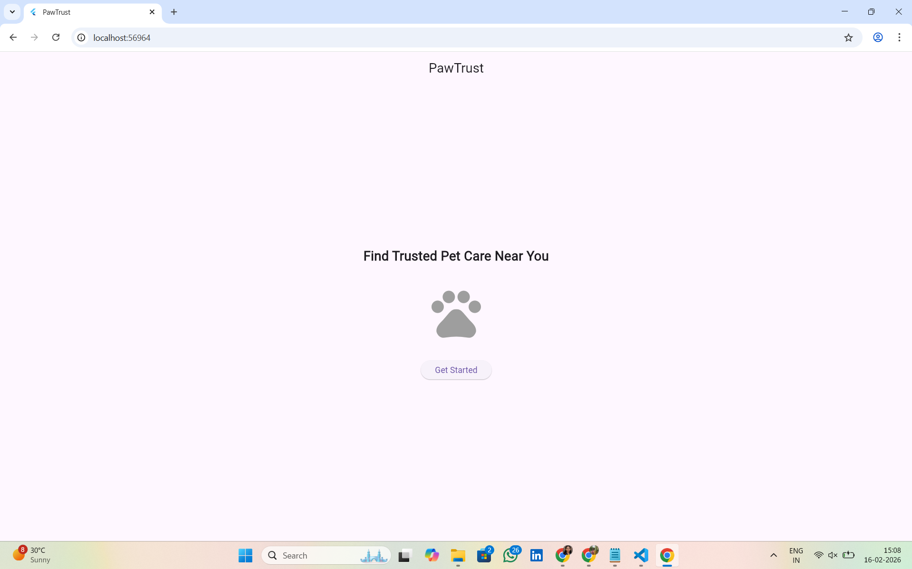
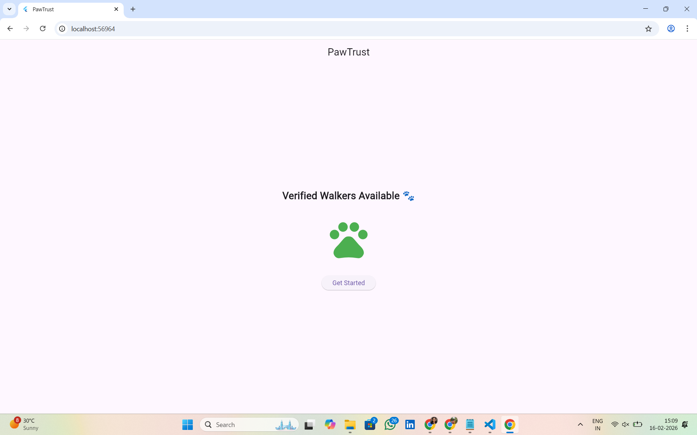

# 🐾 PawTrust – Trusted Pet Care Discovery & Monitoring App

## 📌 Project Overview

PawTrust is a cross-platform mobile application built using Flutter & Dart as part of Sprint #2.

The goal of PawTrust is to solve a real-world problem:

Pet owners in cities often struggle to find trustworthy walkers or caregivers. There is no secure way to verify identity or stay updated about their pet’s wellbeing.

PawTrust aims to create a trusted discovery and monitoring system that ensures:

- Verified caregiver profiles
- Secure identity validation
- Real-time updates for pet owners
- Safe and transparent communication

This sprint focuses on setting up the Flutter environment and building the foundational UI for the app.

---

## 🚀 Features Implemented (Sprint #2)

- Flutter project initialization
- Clean folder structure setup
- Custom Welcome Screen UI
- Stateful widget implementation
- Button interaction with state change
- Dynamic UI updates using setState()

---

## 📁 Folder Structure

```
lib/
├── main.dart
├── screens/
│   └── welcome_screen.dart
├── widgets/
├── models/
├── services/
```

### 🔹 Directory Explanation

- **main.dart**  
  Entry point of the application. It initializes the app and loads the first screen.

- **screens/**  
  Contains complete UI screens.  
  Example: `welcome_screen.dart`.

- **widgets/**  
  Stores reusable UI components (buttons, cards, etc.) for modular design.

- **models/**  
  Will contain data models (User, Pet, Walker, Booking, etc.).

- **services/**  
  Will handle backend logic like Firebase, APIs, authentication, or location services.

### ✅ Why This Structure?

This modular architecture:
- Improves scalability
- Keeps UI and logic organized
- Makes the project easier to maintain
- Follows industry-standard Flutter practices

---

## ⚙️ Setup Instructions

### 1️⃣ Install Flutter SDK  
Download from: https://flutter.dev/docs/get-started/install

Verify installation:
```
flutter doctor
```

### 2️⃣ Clone the Repository
```
git clone <your-repository-url>
cd pawtrust
```

### 3️⃣ Install Dependencies
```
flutter pub get
```

### 4️⃣ Run the Application
```
flutter run
```

You can select:
- Chrome (Web)
- Windows (Desktop)
- Android Emulator (if configured)

---

## 📸 Demo

| Initial Screen | After Interaction |
|---------------|-------------------|
|  |  |


## 💡 Reflection – What I Learned

During this sprint, I learned:

- How to install and configure Flutter
- How to structure a Flutter project properly
- Difference between StatelessWidget and StatefulWidget
- How `setState()` updates the UI dynamically
- How widget trees are built in Flutter
- How modular folder structure helps scale real-world apps

This foundation will help in building complex features like:

- Authentication systems
- Real-time location tracking
- Verified caregiver profiles
- Live updates and monitoring systems

---

## 🔮 Future Enhancements

Planned features for upcoming sprints:

- User authentication (Pet Owner / Walker roles)
- ID verification system
- Real-time GPS tracking
- In-app chat
- Ratings & reviews
- Emergency SOS button
- Push notifications

---

## 🛠 Tech Stack

- Flutter
- Dart
- Material Design

---

## 👩‍💻 Author

Developed as part of Sprint #2 – Cross Platform Mobile App Development  
Team: PawTrust
